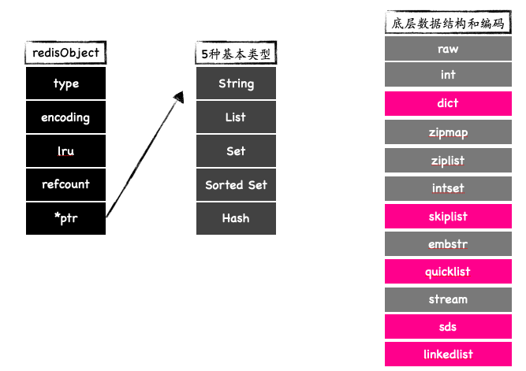
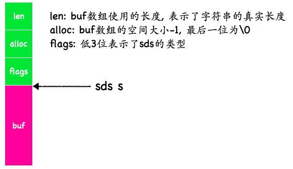
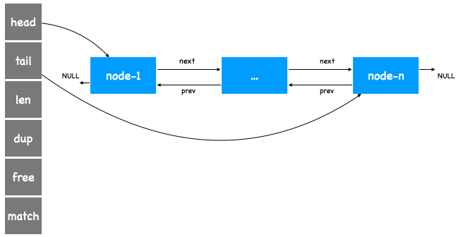
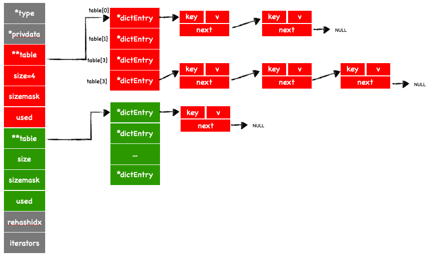
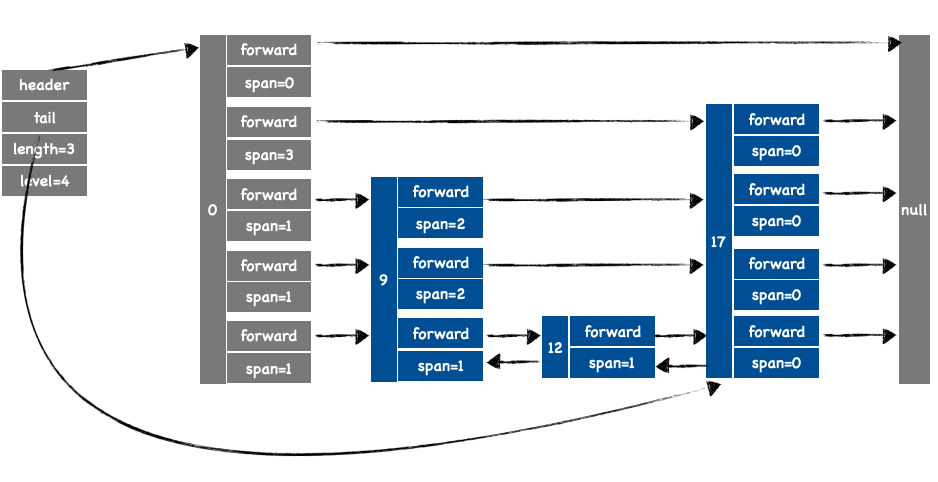

<!-- TOC -->

- [数据类型](#数据类型)
  - [SDS 动态字符串](#sds-动态字符串)
    - [结构](#结构)
    - [特点](#特点)
  - [adlist 双向链表](#adlist-双向链表)
    - [结构](#结构-1)
  - [dict 字典](#dict-字典)
    - [结构](#结构-2)
    - [要点](#要点)
  - [skiplist 跳跃表](#skiplist-跳跃表)
    - [结构](#结构-3)
    - [要点](#要点-1)
  - [quicklist 快速列表](#quicklist-快速列表)
  - [ziplist 压缩列表](#ziplist-压缩列表)
  - [intset 整数集合](#intset-整数集合)
  - [stream 流](#stream-流)
  - [zipmap](#zipmap)
  - [raw和embstr](#raw和embstr)
- [Server启动过程](#server启动过程)
- [事件分发机制](#事件分发机制)

<!-- /TOC -->
# 数据类型


## SDS 动态字符串
### 结构


```c++
typedef char *sds;
// __attribute__ 设置内存对齐
// __packed__ 紧凑型，相当于取消了内存对齐
/* Note: sdshdr5 is never used, we just access the flags byte directly.
 * However is here to document the layout of type 5 SDS strings. */
struct __attribute__ ((__packed__)) sdshdr5 {
    unsigned char flags; /* 3 lsb of type, and 5 msb of string length */
    char buf[];
};
// len: 记录buf中已用的内存空间 多少字节
// alloc: buf总共的空间 多少字节
// flags: 低3位表示sds类型
// buf: 存储字符的空间  buf最后一位为\0

// 字符串长度小于 2^8 - 1
struct __attribute__ ((__packed__)) sdshdr8 {
    uint8_t len; /* used */
    uint8_t alloc; /* excluding the header and null terminator */
    unsigned char flags; /* 3 lsb of type, 5 unused bits */
    char buf[];
};
// 字符串长度小于 2^16 - 1
struct __attribute__ ((__packed__)) sdshdr16 {
    uint16_t len; /* used */
    uint16_t alloc; /* excluding the header and null terminator */
    unsigned char flags; /* 3 lsb of type, 5 unused bits */
    char buf[];
};

// 字符串长度小于 2^32 - 1
struct __attribute__ ((__packed__)) sdshdr32 {
    * uint32_t len; /* used */
    uint32_t alloc; /* excluding the header and null terminator */
    unsigned char flags; /* 3 lsb of type, 5 unused bits */
    char buf[];
};

// 字符串长度小于 2^64 - 1
struct __attribute__ ((__packed__)) sdshdr64 {
    uint64_t len; /* used */
    uint64_t alloc; /* excluding the header and null terminator */
    unsigned char flags; /* 3 lsb of type, 5 unused bits */
    char buf[];
};
```

### 特点
- 二进制安全
  C字符串中以'\0'为结束符，所以统计字符串时遇到\0就结束，这样导致C字符串无法存储一些二进制数据，sds通过buf数组用来存储字符串，并且在头部利用len变量记录了字符串的实际长度，这样就可以支持存储二进制数据。
  宏NULL、字符'\0'、十进制0 对应的ASCII都是0，二进制 0000 0000; "0" ASCII是48,二进制 0011 0000
  ```c++
  #ifndef NULL
  #ifdef __cplusplus
  #define NULL 0
  #else
  #define NULL ((void *)0)
  #endif
  #endif
  ```
- 获取字符串长度时间复杂度O(1)
  头部len记录了字符串长度
- 避免内存越界
  通过在头部存储了buf数组的总空间大小和已用空间大小，可以保证在做字符串拼接、截取等操作时能有效判断空间是否够用，避免内存越界。c中内存越界例子: 两个连续内存空间存储了两个字符数组进行拼接之后，第二个字符数组的内容被改变了。
- 兼容部分C函数
  sds的buf为字节数组，并且最后一位都会被设置为'\0'，这样就兼容了C中的一些函数
- 动态扩展内存和预分配内存
  比如sds扩容的策略时，如果需要的内存大小小于(最大预分配大小)1M，则会2倍扩容，否则会多扩容1M，采用这样的预分配策略可以减少很多的内存分配操作,如果内存空间够用，在多次append字符串时可以直接在内存空间中存放数据。
  ```c++
    len = sdslen(s);
    sh = (char *) s - sdsHdrSize(oldtype);
    // 新长度
    newlen = (len + addlen);
    // 新长度小于最大预分配大小, 按新长度的2倍扩容
    // #define SDS_MAX_PREALLOC (1024*1024)
    if (newlen < SDS_MAX_PREALLOC)
        newlen *= 2;
    else
        // 否则就加1MB
        newlen += SDS_MAX_PREALLOC;
  ```
- 惰性释放
  sdsclear()函数用于置空sds字符串，该函数只是将头部len变量设置为0，将buf第一字节设置为\0，而不会立即回收内存空间, 并通过相关api将内存管理交给上层决定。
  ```c
  void sdsclear(sds s) {
      sdssetlen(s, 0);
      s[0] = '\0';
  }
  ```
## adlist 双向链表
### 结构


## dict 字典

### 结构


```c++
// 字典表节点
typedef struct dictEntry {
    void *key;
    union {
        void *val;
        uint64_t u64;
        int64_t s64;
        double d;
    } v;
    struct dictEntry *next;
} dictEntry;
// hash table
typedef struct dictht {
    dictEntry **table;  // hash table表 链表结构
    unsigned long size; // hash table表大小
    unsigned long sizemask; // 掩码
    unsigned long used; // hast table表中容量
} dictht;
// 字典表
typedef struct dict {
    dictType *type;
    void *privdata;
    dictht ht[2];  // 两个hash talbe
    long rehashidx; /* rehashing not in progress if rehashidx == -1 */
    unsigned long iterators; /* number of iterators currently running */
} dict;
```
### 要点
1. 字典表中的ht[0]是作为数据存储的主要hash表, ht[1]是在rehash过程中作为临时数据存储用的。
2. . 创建
   首次创建字典表时, 只是申请dict结构体的占用的内存空间，不会初始化hash表。
3. 插入键值对key-value
   1. 如果hash表正在rehash，并且安全迭代器计数为0时, 渐进式rehash一步, 一步为hash表中的一个桶。 (安全迭代器和非安全迭代器??)
   2. 计算key对应的桶坐标的过程中, 会去判断是否需要进行hash表扩张(或者初始化hash表, 因为初次创建字典表时, 不会创建hash表，所以首次插入键值对，一定会扩张，初始化hash表)
   3. 如果key已经存在了, 不会创建新节点, 会返回一个指向这个节点的指针, 方便上层调用者灵活处理
   4. 头插法, 基于数据库系统总是会经常访问最近添加的节点
4. rehash策略
   1. 没有安全迭代器访问
   2. 渐进式rehash, 每次rehash n个桶或者至多n*10个空桶
   3. 触发rehash：dictAddRaw、dictGenericDelete、dictFind、dictGetRandomKey、dictGetSomeKeys、定时
5. 扩张策略
   1. 初次插入键值对一定扩张
   2. 2次幂策略：将hash表大小扩张为需要大小的最近2次幂  4 -> 8   7 -> 8
   3. 当hash表中键值对数量大于hash表数组的大小，并且字典表的可以扩张配置参数为1 或者 hash表中键值对数量 / hash表数组的大小 > 强制扩张率
   ```c++
   if (d->ht[0].used >= d->ht[0].size &&
        (dict_can_resize ||
         d->ht[0].used / d->ht[0].size > dict_force_resize_ratio)) {
        return dictExpand(d, d->ht[0].used * 2);
    }
   ```
   
## skiplist 跳跃表
### 结构
```C++
/**
 * 跳跃表节点
 */
typedef struct zskiplistNode {
    sds ele; // 节点保存的数据 sds
    double score; // 分值
    struct zskiplistNode *backward;  // 回退指针
    struct zskiplistLevel {  // 节点所在的层
        struct zskiplistNode *forward; // 该层的前向节点
        unsigned long span; // 跨度
    } level[]; //  柔性数组, 最大64
} zskiplistNode;
/**
 * 跳跃表
 */
typedef struct zskiplist {
    struct zskiplistNode *header, *tail;  // 头节点，尾节点
    unsigned long length;  // 节点数量
    int level; // 最大层级
} zskiplist;
```


### 要点
1. 允许分数重复
2. 比较两个节点大小时，先比较分数，再比较数据
   ```c++
    while (x->level[i].forward &&
               (x->level[i].forward->score < score ||
                (x->level[i].forward->score == score &&
                 sdscmp(x->level[i].forward->ele, ele) < 0))) {
            rank[i] += x->level[i].span;
            x = x->level[i].forward;
        }
   ```
  3. 每一个节点都有一个回退指针，第0层相当于是一个双向链表
  
  ## quicklist 快速列表

  ## ziplist 压缩列表

  ## intset 整数集合

  ## stream 流

  ## zipmap

  ## raw和embstr

  # Server启动过程

  Redis启动过程主要完成了：
  1. 初始化服务端的配置
   包括初始化命令集合、是否开启sentinel模式、配置文件加载
  2. 创建事件管理器
   通过IO多路复用底层库，在kernel中创建一个IO多路复用句柄。然后在事件管理器中，添加时间管理器和文件管理器，其本质就是向IO多路复用句柄中注册需要监听的fd。
  3. 监听端口、初始化数据库 
  4. 从aof文件加载数据
  5. 启动事件管理器
   不间断的处理文件事件和时间事件。

# 事件分发机制