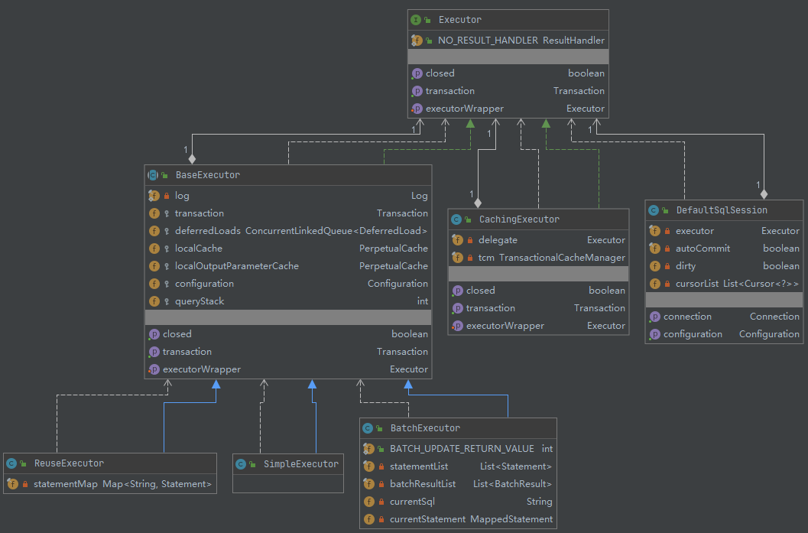

## Executor 执行器

执行器主要负责SQL的执行逻辑。在Mybatis中一共有三种类型：SIMPLE、REUSE和BATCH。这三种执行器都继承了BaseExecutor，而BaseExector实现了Exector接口。在Excetor接口中包含各个执行器公共的方法，比如update query commit rollback close等，BaseExector实现了这些方法的同时，提供一些事务管理、一级缓存等功能。而SIMPLE、REUSE、BATCH三种执行器主要实现了BaseExector中的一些抽象方法，比如doQuery、doUpdate等。其中，SimpleExecutor是默认执行器，实现了BaseExecutor的抽象方法，没有额外的增加功能。ReUseExecutor在SimpleExecutor的基础之上，增加了一个HashMap结构，用来缓存解析之后的Statement。BatchEexcutor则增加了List集合用于存储多个Statement。



### 执行器类型

三种执行器类型：SIMPLE、REUSE、BATCH

```java
// 三种执行器类型
public enum ExecutorType {
  SIMPLE, REUSE, BATCH
}
```
